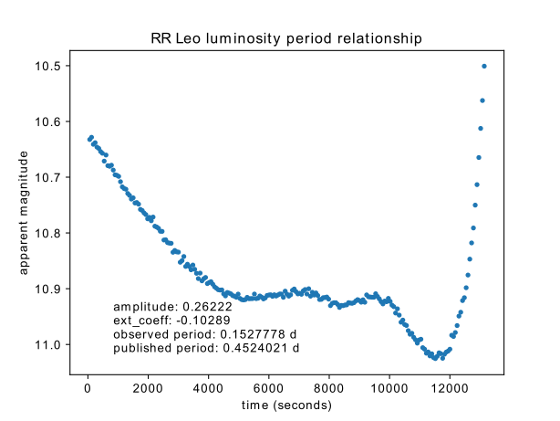

# RR Leo Photometry

RR Leo, an RR Lyrae type variable star has a luminosity period of 0.4524021 days. This photometry project aims to demonstrate RR Leo’s periodic luminosity in visual band with data span over 3.5 hours collected at Trottier Observatory on March 10, 2021. The partial variation of apparent magnitudes over time were plotted to show the luminosity-period relation of RR Leo. This paper explains the methodology used, noise reduction, source extraction and atmospheric extinction in the project.

## Introduction

RR Lyrae type variable stars are stars whose apparent magnitudes change periodically. They can have periods ranging from a 0.05 days to 1.2 days. Such stars, are intrinsic pulsating variables, are white giants with short periods and significant magnitude variations. These variations in magnitude range from 0.3 to 2. The unique period-luminosity relation of RR Lyrae type stars makes them a good standard candle for measuring the distances of relatively nearby celestial targets

This project focuses on measuring the luminosity period of RR Leo, a single period RR Lyrae variable star. Located in the Leo constellation, RR Leo is highly observable in the northern hemisphere during spring time. RR Leo has a period of 0.4524021 days (approx. 11 hours) and a visual (V) band magnitude range of approx. 9.921-11.254.

## Methodology

This project aimed to present the full periodic variation of luminosity of RR Leo. However, due to the time limitation of telescope operation, only 3.5 hours of data were collected under V band filter at Trottier Observatory. 219 raw data frames were collected, with each exposed for 60 seconds and binned to 2048 by 2048 pixels.

The data first went through the process of calibration with master Bias, master dark current and master flat frames. This process reduces the effect of dark current in CCD during data collection and lowers the overall noise. The calibrated science frames then went through the sky subtraction procedure using SEP, a Python library for source extraction and photometry. The sky subtraction procedure removed artificial and urban lights reflected from atmosphere. Once the sky background is subtracted, then in theory, all light sources in the science frames are due to astronomical source only.

Using SEP, all objects within a 750 by 750 pixels box at the centre with ADU count at 1.5 sigma above the science frame were extracted. The object extracted with the highest ADU count would be RR Leo. Then using SEP again, the Kron radius of RR Leo in each frame was calculated. The Kron radius was used in the calculation of the flux of RR Leo and its error.

)

%5Cleft%7C%7B-2.5%20/%20(F%5Cln%7B10%7D%20/%20t_%7Bexp%7D)%7D%5Cright%7C)

where _m_ is the instrumental magnitude, _F_ is the total flux of object in the frame, _t_exp is the exposure time (i.e. 60 seconds) and _σ_ are the corresponding errors.

In order to obtain the apparent magnitude of RR Leo in each frame, the apparent magnitude of a standard reference star in the same frame has to be known. In this project, GSC 1968:912 is used as the reference star. It has an apparent magnitude of 11.02 in V band. GSC 1968:912 was extracted from the same frame and its instrumental magnitude was calculated using the equations above. Then, the apparent magnitude of RR Leo was calculated by subtracting the magnitude offset of GSC 1968:912 from RR Leo’s instrumental magnitude.

In addition, the atmospheric extinction has effects on the brightness and wavelength of the observed objects. By applying a linear fit on the magnitude of the brightest object in all the frames and the air mass (i.e. the thickness of the atmosphere in units of the thickness towards the zenith) at which the frame was captured,

where _m_λ is the measured magnitude, _m_λ0 is the magnitude as seen above the atmosphere, _X_ is the air mass and the atmospheric extinction coefficient, _k_λ, is measured and labelled on the resulting graph.

## Result

The apparent magnitude of RR Leo and its error in each frame were plotted in the figure, with respect to the time in the data collection period. The observed luminosity-period has an amplitude of 0.26. And since the data collection process only lasted for about 3.5 hours and the previously documented period of RR Leo is approximately 11 hours, this project could not capture the full variation of intrinsic brightness of RR Leo. The variation trend plotted in the figure did partially correlate with the majority of period-luminosity relation of RR Lyrae type stars. Under the assumption that the result represents partial scope of published RR Lyrae type variable stars luminosity-period relation, RR Leo reaches the dimmest apparent magnitude of 11.02 and the brightest apparent magnitude of 10.50.

## Reference

1. W. MacDonald, _Introducing Variable Stars_, Royal Astronomical Society of Canada (RASC), March 2, 2019. https://www.rasc.ca/variable-stars
1. T. Dickinson et al., _Nightwatch: A Practical Guide to Viewing the Universe_ 4th ed., Firefly Books Ltd. 2016, pp. 41-45.
1. _The International Variable Star Index: RR Leo_, The American Association of Variable Star Observers. (AAVSO), Cambridge, Massachusetts, USA (accessed: Feb 2021). https://www.aavso.org/vsx/index.php?view=detail.top&oid=17041
1. Software Bisque, _TheSkyX_, (accessed: March 2021). https://www.bisque.com/product/theskyx-pro/
1. Birney, D., Gonzalez, G., Oesper, D. (2006), _Observational Astronomy_ (2nd ed.). Cambridge:
Cambridge University Press
1. ] I. Soszynski et al., _OGLE Atlas of Variable Star Light Curves_, Optical Gravitational Lensing Experiment (OGLE), (accessed: April 2021). https://www.rasc.ca/variable-stars
